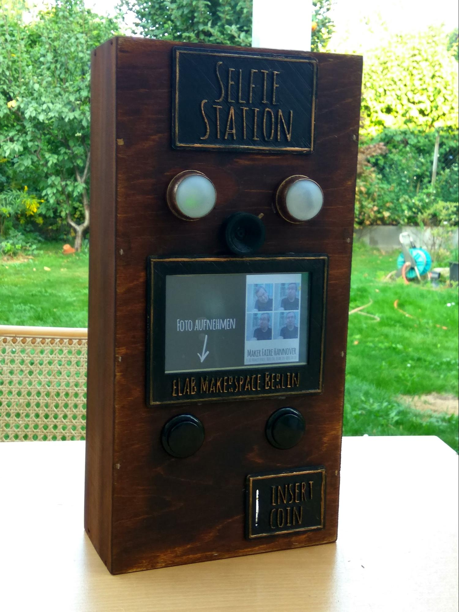
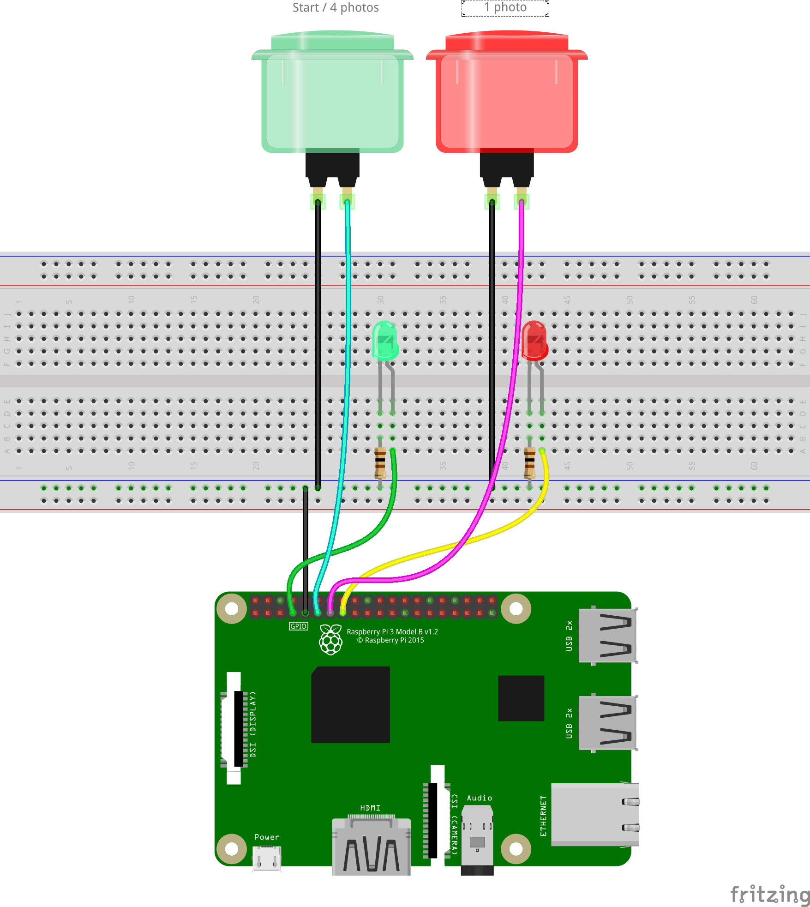

# Selfie Station

## Was macht das? 

Die Selfie Station soll es Besuchern der Maker Faire erlauben, Bilder von sich zu machen. Nach Druck auf den Startknopf und der Auswahl des Formats (1 oder 4 Bilder) werden die Bilder automatisch erstellt. Auf dem eingebauten Monitor ist während der Aufnahme eine Vorschau zu sehen. Gleichzeitig startet der Countdown, bis die Aufnahme(n) gemacht werden. Die fertigen Bilder werden per FTP auf einen Web Server geladen und es wird ein QR-Code mit dem Link zu dem Foto erstellt. Der Besucher kann den QR-Code mit einem Smartphone scannen und das Foto auf sein Smartphone laden. 

## Woraus besteht es?

Die Selfie Station besteht aus folgenden Komponenten:

* Raspberry Pi B 3  
* Raspberry Pi Kamera  
* Raspberry Pi HDMI Monitor (5 Zoll)  
* 2 Arcade Taster  
* 2 LEDs mit Vorwiderstand 100 Ohm  
* Eine Weinkiste als Gehäuse  
* 3D gedruckte Schilder in Steampunk Optik

## 

## Wodurch inspiriert?

Inspiriert durch diverse Photobooth und Steampunk Projekte im Internet. Die Original Software stammt von [https://pypi.org/project/pibooth/](https://pypi.org/project/pibooth/) 

## Wer hat es gebaut?

Gebaut wurde die Photobooth von Peter 

### Schaltplan

